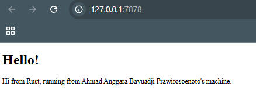
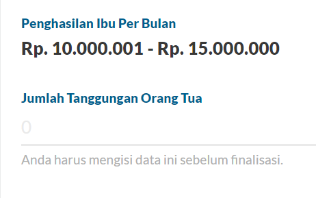

## Commit 1 Reflection notes

Dalam pengerjaan Milestone 1, fungsi handle_connection diimplementasikan untuk membaca dan memproses data yang dikirimkan oleh browser melalui koneksi TCP. Penggunaan BufReader untuk membungkus TcpStream bertujuan untuk meningkatkan efisiensi saat proses pembacaan data dilakukan. Dengan mekanisme ini, data akan ditampung terlebih dahulu dalam buffer di memori sebelum diproses oleh aplikasi, sehingga jumlah system call yang memakan banyak sumber daya dapat diminimalisir secara signifikan.

Proses pembacaan data tersebut dilakukan baris demi baris menggunakan method .lines() yang menghasilkan sebuah iterator. Bagian paling krusial dalam implementasi ini adalah penggunaan .take_while(|line| !line.is_empty()). Logika ini diterapkan karena protokol HTTP menetapkan bahwa akhir dari sebuah header request ditandai dengan satu baris kosong. Tanpa adanya pengecekan tersebut, server tidak akan berhenti membaca dan akan terus menunggu data baru dari koneksi yang masih terbuka, sehingga menyebabkan program mengalami hang. Terakhir, semua baris yang telah dibaca dikumpulkan ke dalam sebuah Vec menggunakan .collect() agar seluruh isi request tersebut dapat dicetak ke konsol untuk kebutuhan debugging dan analisis.

## commit 2 Reflection notes

Implementasi fungsi handle_connection pada Milestone 2 memungkinkan server untuk mengirimkan konten HTML sebagai respon balik kepada browser. Penggunaan module std::fs memfasilitasi pembacaan file hello.html secara sinkron untuk mendapatkan isi pesan yang akan ditampilkan. Agar browser dapat mengenali dan memproses data tersebut dengan benar, respon disusun mengikuti standar protokol HTTP yang mencakup baris status HTTP/1.1 200 OK dan header Content-Length untuk menginformasikan ukuran konten. Pemisah antara header dan isi konten ditandai dengan urutan karakter \r\n\r\n. Seluruh komponen respon tersebut digabungkan menggunakan makro format!, kemudian dikonversi menjadi kumpulan byte melalui .as_bytes(), dan akhirnya dikirimkan melalui TcpStream menggunakan method write_all.

## Commit 33 Reflection Notes

Dalam pengerjaan Milestone 3, dilakukan penambahan logika untuk memvalidasi baris permintaan (request line) dari browser guna memberikan respon yang berbeda tergantung pada path yang diakses. Pemisahan respon dilakukan dengan memeriksa apakah request_line bernilai "GET / HTTP/1.1". Jika kondisi tersebut terpenuhi, server akan mengembalikan status 200 OK beserta isi dari hello.html. Namun, jika permintaan mengarah ke path yang tidak terdaftar, server akan dialihkan ke blok else untuk mengirimkan status 404 NOT FOUND dan menampilkan file 404.html. Logika ini memastikan bahwa pengguna mendapatkan umpan balik yang tepat saat mencoba mengakses konten yang tidak tersedia.

Proses refactoring kemudian dilakukan untuk menghilangkan duplikasi kode yang terdapat pada blok if dan else. Sebelumnya, operasi pembacaan file dan penulisan data ke stream ditulis secara berulang di kedua blok tersebut. Dengan memanfaatkan kapabilitas Rust yang memperlakukan if sebagai sebuah ekspresi, perbedaan nilai berupa baris status dan nama file dapat ditarik ke dalam variabel status_line dan filename. Refactoring ini sangat penting karena membuat kode menjadi lebih ringkas, lebih mudah dibaca, dan mematuhi prinsip DRY (Don't Repeat Yourself). Selain itu, pemeliharaan kode menjadi lebih efisien karena jika terdapat perubahan pada mekanisme pengiriman respon, perubahan tersebut hanya perlu dilakukan di satu tempat saja.

